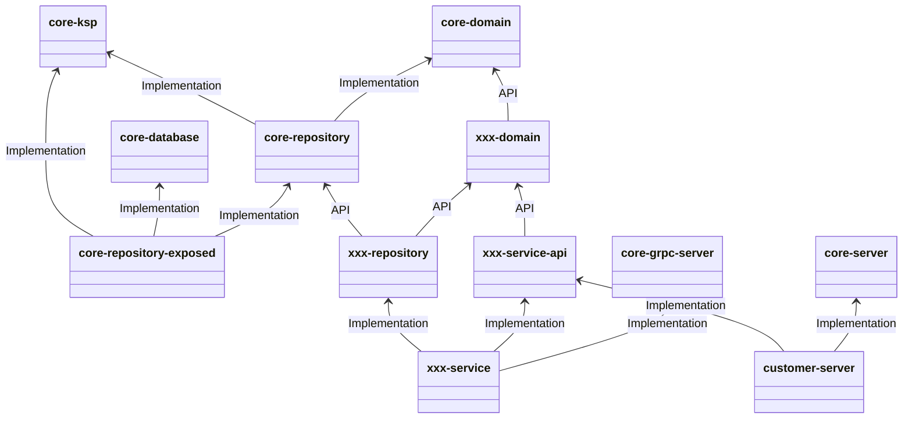

# Jiaolong-0.2

## Project Structure

```mermaid
classDiagram
    class CoreDomain ["core-domain"]

    class CoreKSP ["core-ksp"]

    class CoreDatabase ["core-database"]

    class CoreRepository ["core-repository"]
    CoreDomain <-- CoreRepository: Implementation
    CoreKSP <-- CoreRepository: Implementation

    class CoreRepositoryExposed ["core-repository-exposed"]
    CoreRepository <-- CoreRepositoryExposed: Implementation
    CoreDatabase <-- CoreRepositoryExposed: Implementation
    CoreKSP <-- CoreRepositoryExposed: Implementation

    class CoreServer ["core-server"]

    class CoreGrpc ["core-grpc-server"]

    class XxxDomain ["xxx-domain"]
    CoreDomain <-- XxxDomain: API

    class XxxRepository ["xxx-repository"]
    XxxDomain <-- XxxRepository: API
    CoreRepository <-- XxxRepository: API

    class XxxServiceAPI ["xxx-service-api"]
    XxxDomain <-- XxxServiceAPI: API

    class XxxService ["xxx-service"]
    CoreGrpc <-- XxxService: Implementation
    XxxServiceAPI <-- XxxService: Implementation
    XxxRepository <-- XxxService: Implementation

    class CustomerServer ["customer-server"]
    CoreServer <-- CustomerServer: Implementation
    XxxServiceAPI <-- CustomerServer: Implementation
```

## Project Details

### Core-Domain

This project is one of `core` project contains value/entity base classes.

### Core-KSP

### Core-Database
